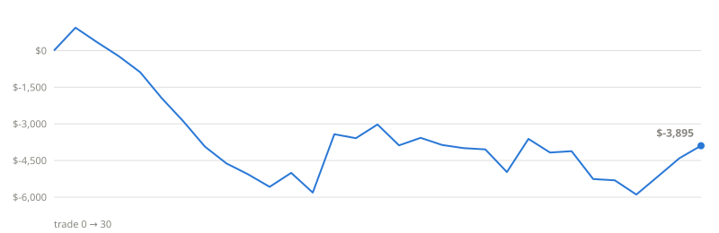

# Silver Bullet Strategy — Accumulating NQ Backtest

Fully mechanical backtest of the ICT "Silver Bullet" setup on E-mini Nasdaq 100 (NQ) futures, 5-minute bars, updated automatically on a schedule (GitHub Actions pulling delayed Yahoo Finance data, plus optional IBKR pulls). Every run re-tests the entire accumulated history, so the trade sample below grows over time.

**Last updated:** 2026-08-20 17:40 UTC · **Rules:** v1.1 (2026-08-18) · **Data:** NQ202609: 3499 bars, 2026-07-29 → 2026-08-16; NQF-continuous: 14320 bars, 2026-06-08 → 2026-08-20; CL: 14089 bars, 2026-06-09 → 2026-08-20; ES: 14045 bars, 2026-06-09 → 2026-08-20

> ⚠️ **Small-sample warning:** results below are not statistically meaningful until the sample reaches well over 100 trades across different market regimes. Treat everything here as an ongoing experiment, not evidence of an edge. Not financial advice.

## Headline (1 contract, after $10/trade costs)

| Net P&L | Trades | Win rate | Profit factor | Max drawdown | Avg/trade |
|---|---|---|---|---|---|
| **−$3,615** | 22 (4T/16S/2X) | 27.3% | 0.63 | $6,755 | −$164 |

T = target hit, S = stopped, X = 2-hour time exit

## Equity curve

## By window (New York time)

| Window | Trades | Win rate | Net $ | Profit factor |
|---|---|---|---|---|
| London 3-4am | 13 | 30.8% | −$775 | 0.87 |
| AM 10-11am | 2 | 0.0% | −$645 | 0.0 |
| PM 2-3pm | 7 | 28.6% | −$2,195 | 0.34 |

## Cross-market robustness

Same mechanical rules run on other markets (continuous front-month, Yahoo data). Scored in **R-multiples** — profit measured in units of initial risk — so different point values compare fairly. NQ row uses the NQ trades above.

| Market | Trades | Win % | Avg R | Total R | Profit factor (R) | Net $ (1 contract) |
|---|---|---|---|---|---|---|
| NQ | 22 | 27.3% | -0.3 | -6.62 | 0.59 | −$3,615 |
| CL | 5 | 20.0% | -0.4 | -2.0 | 0.5 | −$240 |
| ES | 28 | 39.3% | 0.1 | 2.87 | 1.18 | +$870 |

## Old vs New — the retro comparison

The parameter analysis (Aug 2026) found the base spec's consistent failures — the PM window, gap-edge stops, and NQ itself — and produced a fixed spec: **v2 = ES only · London+AM windows · 2R target · breakeven stop after +1R**. Both are re-run over all accumulated history on every update. v2 was *selected* on this same history (selection bias), so its edge is overstated here — the growing out-of-sample record is the real verdict.

| Spec | Trades | Win % | Avg R | Total R | PF | IS → OOS |
|---|---|---|---|---|---|---|
| OLD — base spec · all markets · all windows | 55 | 32.7% | -0.164 | -9.0 | 0.76 | -0.139 → -0.22 |
| NEW v2 — ES only · London+AM · 2R · breakeven after +1R | 20 | 45.0% | 0.359 | 7.19 | 1.86 | 0.472 → 0.097 |

## System Lab — which variant is most profitable?

Every mechanical variant of the strategy, run on all markets, ranked by total cost-adjusted R (profit in units of risk, after $10/trade costs). **How to read this honestly:** with this many variants, the top row will always look good by luck alone. Trust a variant only if it has a ✅ robust flag — positive overall, positive **out-of-sample** (the last 30% of trades, which it was not selected on), and positive in at least two markets — and only if it KEEPS its flag as data accumulates over the coming months.

| Rank | Variant | Trades | Win % | Avg R | Total R | PF | NQ avg R | ES avg R | CL avg R | IS → OOS | Robust |
|---|---|---|---|---|---|---|---|---|---|---|---|
| 1 | 2R · breakeven stop after +1R | 55 | 30.9% | -0.033 | -1.82 | 0.94 | -0.236 (22) | 0.193 (28) | -0.409 (5) | -0.002 → -0.098 | — |
| 2 | 1R target · stop@sweep | 55 | 49.1% | -0.1 | -5.52 | 0.82 | -0.236 (22) | 0.061 (28) | -0.409 (5) | -0.02 → -0.265 | — |
| 3 | 2R target · stop@sweep (base) | 55 | 32.7% | -0.164 | -9.0 | 0.76 | -0.335 (22) | 0.05 (28) | -0.609 (5) | -0.142 → -0.209 | — |
| 4 | 3R target · stop@sweep | 55 | 27.3% | -0.177 | -9.72 | 0.77 | -0.395 (22) | 0.179 (28) | -1.209 (5) | -0.042 → -0.453 | — |
| 5 | 2R · no time exit (hold 6.5h) | 55 | 29.1% | -0.186 | -10.24 | 0.75 | -0.352 (22) | 0.019 (28) | -0.609 (5) | -0.144 → -0.274 | — |
| 6 | 1.5R target · stop@sweep | 55 | 34.5% | -0.264 | -14.5 | 0.62 | -0.426 (22) | -0.057 (28) | -0.709 (5) | -0.223 → -0.348 | — |
| 7 | 3R target · stop@gap edge | 114 | 23.7% | -0.19 | -21.71 | 0.78 | -0.334 (41) | -0.102 (38) | -0.118 (35) | -0.172 → -0.231 | — |
| 8 | FADE the setup (take opposite side) | 55 | 23.6% | -0.473 | -25.99 | 0.4 | -0.482 (22) | -0.441 (28) | -0.609 (5) | -0.539 → -0.335 | — |
| 9 | 1.5R target · stop@gap edge | 114 | 36.0% | -0.228 | -26.02 | 0.69 | -0.261 (41) | -0.268 (38) | -0.146 (35) | -0.266 → -0.148 | — |
| 10 | 2R target · stop@gap edge | 114 | 27.2% | -0.312 | -35.52 | 0.62 | -0.456 (41) | -0.176 (38) | -0.289 (35) | -0.285 → -0.37 | — |
| 11 | 1R target · stop@gap edge | 114 | 37.7% | -0.373 | -42.52 | 0.48 | -0.432 (41) | -0.387 (38) | -0.289 (35) | -0.387 → -0.342 | — |

## Oil Lab — a Silver Bullet restructured for CL

Crude oil's liquidity clock differs from equity indices, so the same sweep→FVG mechanics are scanned across oil-native windows: Brent/London flow, the NYMEX open, the 10:30 EIA report hour, midday, and pre-settlement. Same honesty rules as the System Lab — trust ✅ rows only, and only if they persist as data grows.

| Rank | CL window · target | Trades | Win % | Avg R | Total R | PF | IS → OOS | Robust |
|---|---|---|---|---|---|---|---|---|
| 1 | EIA 10:30-11:30a · 2R | 1 | 100.0% | 1.933 | 1.93 | ∞ | None → 1.933 | — |
| 2 | EIA 10:30-11:30a · 1R | 1 | 100.0% | 0.933 | 0.93 | ∞ | None → 0.933 | — |
| 3 | Pre-settle 1:30-2:30p · 1R | 2 | 50.0% | -0.127 | -0.25 | 0.78 | 0.889 → -1.143 | — |
| 4 | Brent/London 3-4a · 1R | 1 | 0.0% | -1.5 | -1.5 | 0.0 | None → -1.5 | — |
| 5 | Brent/London 3-4a · 2R | 1 | 0.0% | -1.5 | -1.5 | 0.0 | None → -1.5 | — |
| 6 | Midday 12-1p · 1R | 3 | 33.3% | -0.514 | -1.54 | 0.37 | -1.225 → 0.909 | — |
| 7 | Pre-settle 1:30-2:30p · 2R | 2 | 0.0% | -1.127 | -2.25 | 0.0 | -1.111 → -1.143 | — |
| 8 | Midday 12-1p · 2R | 3 | 0.0% | -1.18 | -3.54 | 0.0 | -1.225 → -1.091 | — |
| 9 | NYMEX open 9-10a · 1R | 0 | — | — | — | — | — | — |
| 10 | NYMEX open 9-10a · 2R | 0 | — | — | — | — | — | — |

## Recent trades

| Date | Window | Dir | Entry | Risk (pts) | Exit | P&L |
|---|---|---|---|---|---|---|
| 2026-08-20 | London 3-4am | bear | 29643.25 | 34.25 | target | +$1,360 |
| 2026-08-19 | PM 2-3pm | bull | 29537.75 | 46.0 | stop | −$930 |
| 2026-08-18 | PM 2-3pm | bull | 29592.5 | 2.0 | stop | −$50 |
| 2026-08-18 | AM 10-11am | bull | 29637.0 | 6.0 | stop | −$130 |
| 2026-08-17 | London 3-4am | bear | 30313.0 | 14.25 | stop | −$295 |
| 2026-08-13 | London 3-4am | bull | 29866.0 | 8.0 | target | +$310 |
| 2026-08-11 | London 3-4am | bull | 29770.0 | 42.25 | stop | −$855 |
| 2026-08-06 | PM 2-3pm | bear | 29524.5 | 51.25 | time | +$560 |
| 2026-08-04 | London 3-4am | bear | 29093.0 | 7.5 | stop | −$160 |
| 2026-07-31 | London 3-4am | bull | 28509.75 | 60.0 | target | +$2,390 |
| 2026-07-22 | London 3-4am | bull | 29090.75 | 40.0 | stop | −$810 |
| 2026-07-21 | PM 2-3pm | bear | 29329.25 | 35.75 | time | +$575 |
| 2026-07-10 | AM 10-11am | bear | 29911.75 | 25.25 | stop | −$515 |
| 2026-07-06 | London 3-4am | bear | 29839.75 | 21.75 | stop | −$445 |
| 2026-06-29 | PM 2-3pm | bear | 30004.5 | 34.0 | stop | −$690 |

Full log: [trades.csv](trades.csv) · raw stats: [results.json](results.json) · interactive report: [report.html](report.html) (download to view)

## The mechanical rules

Windows 3–4 AM / 10–11 AM / 2–3 PM NY. Liquidity sweep = bar takes out the prior 2-hour extreme and closes back inside (scanned from 30 min before the window). First fair value gap (≥0.5 pt, displacement candle closing in bias direction) forming inside the window after the sweep. Limit entry at the near gap edge, must fill before window close. Stop 1 tick beyond the sweep extreme (skip if risk > 60 pts). Target 2R. 2-hour time exit. Same-bar stop+target counts as a loss. One trade per window. $10 round-trip costs, $20/point, 1 contract.

## Caveats

Data is IBKR's 10-minute-delayed consolidated feed (fine for end-of-day analysis). IBKR serves at most 3,500 bars (~13.5 trading days of 5-min) per pull, which is why this repo accumulates them twice weekly — a missed fortnight of runs would leave a permanent gap. Contract months are kept as separate price series to avoid roll artifacts; trades are deduplicated per (day, window) across contracts. Limit fills are assumed at the touched price with no queue — real fills would be somewhat worse.
